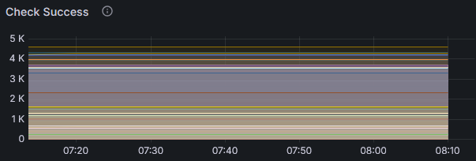
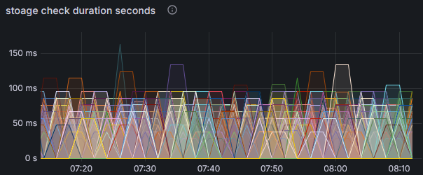

# storagecheck


checks in Kubernetes cluster the possibilty to create a PVC and bound on a POD, periodically.

serve Prometheus metrics for the status




## installation

via Helm

## alert

Runbook for `StorageCheckFailed`. The counter for failed checks is bigger then 0.

* Check Pod/PVC for `Pending` state
* Describe resource to find out the reason
* Find outz which `StorageClass` is used
* Repair CSI of the corresponding StorageClass
* Restart storagecheck deployment to reset counter

## metrics

```
# HELP storage_check_cleanup_failure_total Total number of failed cleanups of previous checks
# TYPE storage_check_cleanup_failure_total counter
storage_check_cleanup_failure_total 0
# HELP storage_check_cleanup_success_total Total number of successful cleanups of previous checks
# TYPE storage_check_cleanup_success_total counter
storage_check_cleanup_success_total 0
# HELP storage_check_duration_seconds Duration of storage checks in seconds
# TYPE storage_check_duration_seconds histogram
storage_check_duration_seconds_bucket{le="0.005"} 0
storage_check_duration_seconds_bucket{le="0.01"} 0
storage_check_duration_seconds_bucket{le="0.025"} 0
storage_check_duration_seconds_bucket{le="0.05"} 0
storage_check_duration_seconds_bucket{le="0.1"} 0
storage_check_duration_seconds_bucket{le="0.25"} 0
storage_check_duration_seconds_bucket{le="0.5"} 0
storage_check_duration_seconds_bucket{le="1"} 0
storage_check_duration_seconds_bucket{le="2.5"} 0
storage_check_duration_seconds_bucket{le="5"} 0
storage_check_duration_seconds_bucket{le="10"} 1
storage_check_duration_seconds_bucket{le="+Inf"} 1
storage_check_duration_seconds_sum 8.02171965
storage_check_duration_seconds_count 1
# HELP storage_check_failure_total Total number of failed storage checks
# TYPE storage_check_failure_total counter
storage_check_failure_total 0
# HELP storage_check_success_total Total number of successful storage checks
# TYPE storage_check_success_total counter
storage_check_success_total 1
```

## Credits

Frank Kloeker f.kloeker@telekom.de

Life is for sharing. If you have an issue with the code or want to improve it, feel free to open an issue or an pull request.
